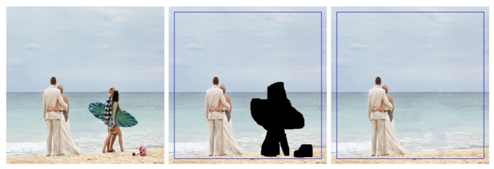
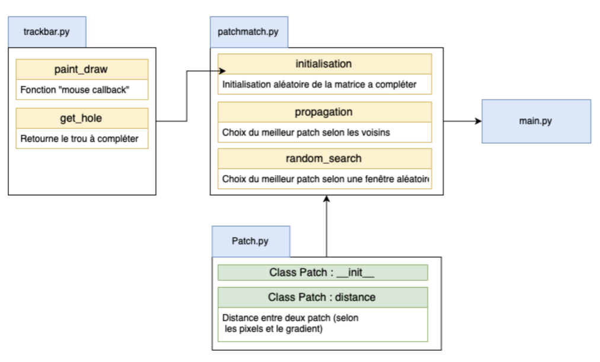
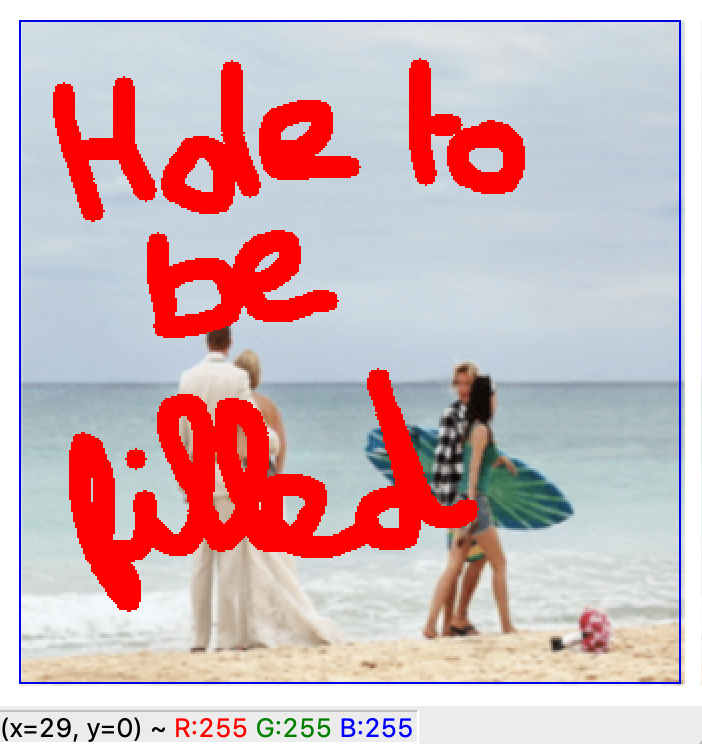

# Image Inpainting
Inpainting is the automatic reconstruction of missing or damaged parts of an image.

 

## Structure
The project contains the following files:
* main.py: launch the algorithm, 
* Patch.py: class of patches
* trackbar.py: user interface for tracing holes
* utils.py: visualization, verification, evaluation functions
* test.py: test the implemented improvements and hyperparameters

 


## Launching the programme
To start the program, write the following command line :
 ```js
python main.py --image_input <IMAGE.JPG> --dir_name <dir_outputs> --nombre_etapes 10 --taille 12 --sizebrush 10
```

A window named "windows" then opens with the image, and the user can draw the holes he wants to apply to the image.

 


Progressive steps:

Step 1         |  Step 2 
:-------------------------:|:-------------------------: 
   |    |  

Step 3         |  Step 4
:-------------------------:|:-------------------------: 
   |    |  

 Step 8        |  Step 9
:-------------------------:|:-------------------------: 
   |    |  

